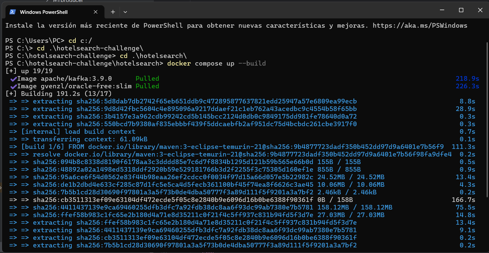

# Hotel Availability Searches

Servicio que registra busquedas de disponibilidad hotelera y cuenta cuantas busquedas iguales existen.

## Flujo

```
POST /search ──> valida ──> Kafka (hotel_availability_searches) ──> consumer ──> Oracle
GET  /count  ──────────────────────────────────────────────────────────────────> Oracle
```

1. `POST /search` valida el payload, asigna un `searchId` (UUID) y publica la busqueda en Kafka.
2. Un consumidor lee el topic `hotel_availability_searches` y guarda la busqueda en Oracle.
3. `GET /count` devuelve la busqueda y cuantas busquedas identicas existen.

## Stack

Java 21 · Spring Boot 3.5 · Spring Kafka · Spring JDBC (`JdbcClient`) · Oracle Free 23ai · Apache Kafka (KRaft) · springdoc-openapi · JUnit 5 · Mockito · Jacoco · Docker Compose.

## Como levantarlo

Solo hace falta **Docker** y **docker-compose**. La aplicacion se compila dentro de Docker. Se recomienda utilizar Docker Desktop y ejecutar el siguiente comando en la raiz del proyecto como administrador en powershell

```bash
docker compose up --build
```


La primera vez tarda unos minutos (descarga de imagenes y arranque de Oracle). Cuando termina, la API queda en `http://localhost:8080`.

En caso de no poder correr los comandos se recomienda instalar **WSL** si tenemos windows, nos permite utilizar terminal de tipo Linux y ejecutar los comandos de docker compose. En caso de no poder instalar WSL, se recomienda instalar **Git Bash** y ejecutar los comandos de docker compose.

Para detener y borrar los datos:

```bash
docker compose down -v
```

## Documentacion de la API

- Swagger UI: http://localhost:8080/swagger-ui.html
- OpenAPI (JSON): http://localhost:8080/v3/api-docs

## Endpoints

### `POST /search`

```bash
curl -X POST http://localhost:8080/search \
  -H "Content-Type: application/json" \
  -d '{"hotelId":"1234aBc","checkIn":"29/12/2023","checkOut":"31/12/2023","ages":[30,29,1,3]}'
```

Respuesta `201`:

```json
{ "searchId": "5d1c7e0a-0f3b-4b1e-9d52-2f6a8f7a9c11" }
```

### `GET /count?searchId=...`

```bash
curl "http://localhost:8080/count?searchId=5d1c7e0a-0f3b-4b1e-9d52-2f96a8f7ac11"
```

Respuesta `200`:

```json
{
  "searchId": "5d1c7e0a-0f3b-4b1e-9d52-2f6a8f7a9c11",
  "search": { "hotelId": "1234aBc", "checkIn": "29/12/2023", "checkOut": "31/12/2023", "ages": [30, 29, 1, 3] },
  "count": 1
}
```

## Validaciones y errores

| Caso | Codigo | Mensaje |
|---|---|---|
| `hotelId` nulo o vacio | 400 | `hotelId es obligatorio` |
| `checkIn` / `checkOut` nulo o vacio | 400 | `checkIn es obligatorio` / `checkOut es obligatorio` |
| Fecha con formato distinto de `dd/MM/yyyy` o inexistente | 400 | `checkIn debe tener formato dd/MM/yyyy` |
| `checkIn` no anterior a `checkOut` | 400 | `checkIn debe ser anterior a checkOut` |
| `ages` nulo o vacio | 400 | `ages es obligatorio` |
| Alguna edad negativa o nula | 400 | `Las edades deben ser >= 0` |
| JSON roto o tipos incorrectos | 400 | `El cuerpo de la peticion es invalido o esta mal formado` |
| `/count` sin `searchId` | 400 | `searchId es obligatorio` |
| `searchId` inexistente | 404 | `No existe una busqueda con searchId: ...` |
| Kafka no disponible | 503 | `No se pudo registrar la busqueda, intente nuevamente` |
| checkIn anterior a hoy | 400 | checkIn no puede ser una fecha pasada |

## Arquitectura (hexagonal)

```
domain          modelos inmutables (records) y reglas de validacion. No depende de nada.
application     puertos (in/out) y servicios de casos de uso. Solo conoce al dominio.
infrastructure  adaptadores: REST, Kafka (producer y consumer separados), JDBC y configuracion.
```

Los casos de uso son clases Java planas; se registran como beans en `infrastructure.config.BeanConfig`, de modo que `application` no usa anotaciones de Spring.

## Decisiones tecnicas

- **Validacion en el dominio:** `HotelSearch` valida en su constructor, por lo que no puede existir una busqueda invalida.
- **Inmutabilidad:** todo son `record`s; `ages` se copia con `List.copyOf` para no depender de la lista original.
- **`searchId` unico:** UUID aleatorio por cada request, aunque la busqueda sea identica a otra.
- **Orden de edades:** `[30,29,1,3]` y `[3,29,30,1]` son busquedas distintas, tal como pide el enunciado. Por eso las edades se guardan como texto ordenado (`"30,29,1,3"`). Nota: el ejemplo de respuesta de `/count` del enunciado muestra las edades reordenadas; aqui se devuelven en el orden original.
- **Sin SQL injection:** `JdbcClient` con parametros nombrados; nunca se concatenan valores al SQL.
- **Thread safety:** los servicios no guardan estado mutable; las fechas usan `DateTimeFormatter` (inmutable).
- **Mensaje de Kafka propio (`SearchMessage`):** el contrato del topic esta separado del modelo de dominio.
- **Consistencia eventual:** como la persistencia es asincrona, un `GET /count` inmediato al `POST /search` puede devolver 404 durante unos instantes.
- **Idempotencia del consumer:** `search_id` es clave primaria y un mensaje repetido se ignora.
- **Hilos virtuales:** `spring.threads.virtual.enabled=true` hace que Spring Boot use hilos virtuales, incluido el listener de Kafka que guarda en base.
- **Fechas:** `LocalDate`, nunca `Date`.

## Tests y cobertura

Los tests no necesitan Oracle ni Kafka reales: usan H2 en modo Oracle y Kafka embebido.

Con Maven instalado:

```bash
mvn verify
```

Solo con Docker:

```bash
docker run --rm -v "$PWD":/app -w /app maven:3-eclipse-temurin-21 mvn verify
```

`verify` falla si la cobertura (lineas, instrucciones, branches y metodos) es menor al 80 %. El reporte queda en `target/site/jacoco/index.html`.

## Estructura del proyecto

```
src/main/java/com/sling/hotelsearch
├── domain/{model,exception}
├── application/{port/in,port/out,service,exception}
└── infrastructure/{rest,kafka/{producer,consumer},persistence,config}
```
